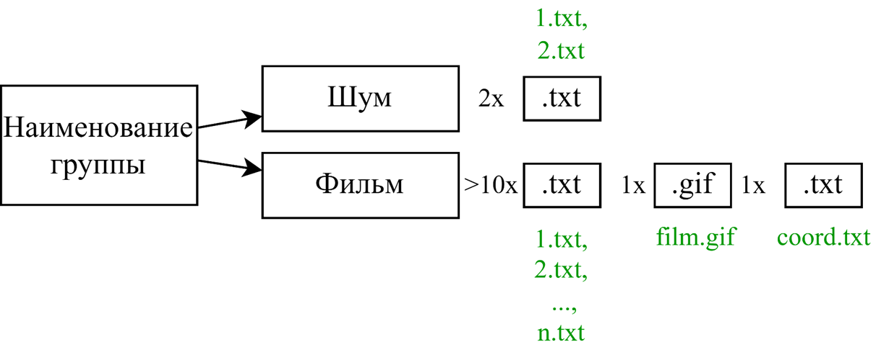

# **Задача: Анализ данных с экзопланеты FAKT-5 (40 баллов)**

## **Условие задачи**

2147 год. Экспедиция корпорации "Астероид" достигла орбиты экзопланеты **FAKT-5** — одного из главных кандидатов на наличие вулканической или техногенной активности. Спутник передал первые снимки в ближнем ИК-диапазоне. Изображения оказались зашумлены, но учёные уверены — среди фона скрыт сигнал от точечных источников излучения на поверхности. Теперь всё зависит от аналитиков на Земле.

На борту спутника установлен высокочувствительный сенсор дистанционного зондирования ($f = 32$ мм, $D = 4$ мм, ближний ИК), предназначенный для наблюдения за активными точечными источниками излучения на поверхности планеты. Размер пикселя матрицы составляет **5 мкм**. Несмотря на большое расстояние, телескоп формирует изображение размером **2000×2000 пикселей**. Каждое изображение представляет собой набор пикселей с различной амплитудой сигнала — от 0 до **512 квантов**. Передача и анализ данных осложнены: слабый полезный сигнал накладывается на фоновое излучение планеты, звезды и галактики. Сигнал зашумлён, при этом шум распределён по Гауссу, Коши и Лапласу. Для удобства уровень нуля сдвинут на **100 квантов**.

Ваша задача — помочь аналитикам Земли в обработке поступающих данных. Необходимо смоделировать шумы, выделить полезный сигнал и по обработанным изображениям восстановить траекторию предполагаемого источника излучения на поверхности планеты. Также требуется оценить качество работы разработанного алгоритма.

---

## **Подробное описание задачи**

### **Создание модельного изображения**

1. **Смоделировать выходное изображение аппаратуры**, содержащее суперпозицию шумов, распределённых по Гауссу, Коши и Лапласу. После этого наложить модельное изображение равномерно движущихся облаков с использованием шума Перлина.
   
2. **Добавить «дефектные» пиксели** – фиксированные пиксели с постоянным значением амплитуды сигнала (от 450 до 512 квантов), занимающие 0,1% поля зрения.

3. **Наложить точечные полезные сигналы** (отношение сигнал/шум = 10, 5 и 2) на полученное изображение. Диаметр кружка Эйри определяется дифракционным пределом разрешения оптической системы.

---

### **Работа с созданными изображениями**

1. **Выделить полезные сигналы** на зашумленном изображении. Обнаруженным считается сигнал, центр которого лежит в пределах 5 пикселей от смоделированного центра.
   
2. **Смоделировать равномерное движение сигнала** на последовательности изображений.

3. **Выделить траекторию движения объекта** на последовательности изображений (длина траектории не менее 5 точек).

4. **Провести оценку качества метода** выделения полезного сигнала: вероятность правильного выделения сигнала, вероятность ложного выделения сигнала, вероятность правильного выделения траектории, вероятность ложного выделения траектории. 

Для проверки корректности обработки изображений можно воспользоваться референсными изображениями.

*Примечание: ваш код должен обрабатывать данные изображения в .txt формате, так как во время оценивания решений оргкомитет будет проверять работоспособность кода на тестовой выборке.*

---

## **Формат выходных данных**

**1. Моделирование:**

Для проверки требуются 2 изображения с шумами и последовательность из 10-15 итоговых изображений (с полезными сигналами, дефектными областями и облаками). Количество полезных сигналов на изображениях от 20 до 40 шт (примерно по 1/3 на каждый вид сигнала по отношению сигнал/шум = 10 (например, 13 шт), 5 (например, 13 шт) и 2 например, 14 шт), пространственно разнесенных. Формат подразумевает изображения в .txt и .gif форматах. Следует создать две папки «Шум» и «Фильм». Расположение файлов и их количество представлено на рисунке ниже:

**2. Обнаружение сигналов:**

Программа для обнаружения формирует текстовый файл («coord.txt»), который содержит следующий набор данных:
-	номер изображения;
-	номер траектории;
-	координата $x$ центра найденного полезного сигнала;
-	координата $y$ центра найденного полезного сигнала;
-	максимальная амплитуда полезного сигнала.

Кроме того, требуются оценки $F1$-меры, записанные в гугл-форму или файл и полученные на моделируемых фильмах:

 $$F_1 = \frac{2\cdot Precision \cdot Recall}{Precision + Recall},$$
 $$Precision = \frac{TP}{TP+FP},$$
 $$Recall = \frac{TP}{TP+FN},$$

 где $TP$ — количество правильно обнаруженных сигналов (сигнал смоделирован и обнаружен), $FP$ — количество неправильно обнаруженных сигналов (сигнал не моделирован, но обнаружен), $FN$ — количество необнаруженных сигналов (сигнал смоделирован, но не обнаружен).

Данные оценки необходимо провести для каждого из трех типов сигнала (отношение сигнал/шум = 10, 5 и 2). Про метрики можно почитать [здесь](problem_data/literature/Review%20of%20the%20F-measure.pdf).

## **Список источников**

1. *Peter Christen, David J. Hand, and Nishadi Kirielle.* A Review of the F-Measure: Its History, Properties, Criticism, and Alternatives

2. *Рытов С.М.* Введение в статистическую радиофизику. Часть 1.

3. *Турлапов В.Е.* Моделирование окружающей среды на основе шумов.

4. *Исаков В.Н.* Случайные сигналы и помехи в радиотехнических системах.

5. Фильтрация изображений.